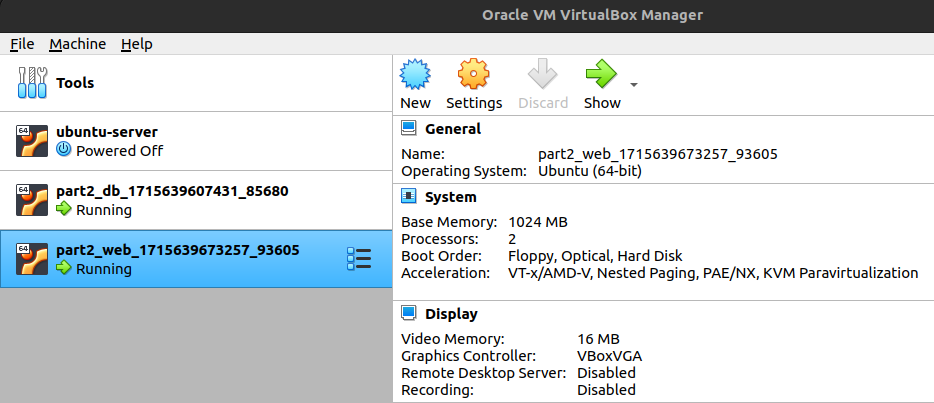

# Report: Class Assignment 3: Part 2

# Virtualization with Vagrant using VirtualBox

### Introduction

In this assignment, we will be using Vagrant to automatically create and configure two virtual machines, one for web
application and another for a database. The web application will be a simple Spring Boot application that connects to a
H2 database.

### Prerequisites

Before we begin, make sure you have the following software installed on your machine:

- [Vagrant](https://www.vagrantup.com/downloads.html)
- [VirtualBox](https://www.virtualbox.org/wiki/Downloads)

## 1 - First Part - Virtualization with Vagrant using VirtualBox

### 1. Create issue in the GitHub repository:

- #19 - Copy and update Vagrantfile
- #20 - Update Classes and Create ServletInitializer class
- #21 - CA3 - Part 2 - Update README.md

### 2. Create the folder CA3/part2

- In the folder "CA3" create the folder "part2":

```bash
mkdir part2
```

- Access the folder "part2":

```bash
cd part2
```

### 3. Clone the repository

[vagrant-multi-spring-tut-demo](https://bitbucket.org/pssmatos/vagrant-multi-spring-tut-demo/src/master/)

### 4. Copy the Vagrantfile to the project folder and update it

- Open a Git bash terminal and in the folder where you usually keep your projects:

```bash
git clone git@bitbucket.org:pssmatos/vagrant-multi-spring-tut-demo.git
```

- From this project, move the "Vagranfile" file to the Devops/CA3/Part2 folder:

```bash
mv ./vagrant-multi-spring-tut-demo/Vagrantfile ./Devops/CA3/Part2
```

Update the Vagrantfile to be compatible with the current project:

```bash
# See: https://manski.net/2016/09/vagrant-multi-machine-tutorial/
# for information about machine names on private network
Vagrant.configure("2") do |config|
  config.vm.box = "ubuntu/bionic64"

  # This provision is common for both VMs
  config.vm.provision "shell", inline: <<-SHELL
    sudo apt-get update -y
    sudo apt-get install -y iputils-ping avahi-daemon libnss-mdns unzip \
        openjdk-17-jdk-headless
    # ifconfig
  SHELL

  #============
  # Configurations specific to the database VM
  config.vm.define "db" do |db|
    db.vm.box = "ubuntu/bionic64"
    db.vm.hostname = "db"
    db.vm.network "private_network", ip: "192.168.56.11"

    # We want to access H2 console from the host using port 8082
    # We want to connet to the H2 server using port 9092
    db.vm.network "forwarded_port", guest: 8082, host: 8082
    db.vm.network "forwarded_port", guest: 9092, host: 9092

    # We need to download H2
    db.vm.provision "shell", inline: <<-SHELL
      wget https://repo1.maven.org/maven2/com/h2database/h2/1.4.200/h2-1.4.200.jar
    SHELL

    # The following provision shell will run ALWAYS so that we can execute the H2 server process
    # This could be done in a different way, for instance, setiing H2 as as service, like in the following link:
    # How to setup java as a service in ubuntu: http://www.jcgonzalez.com/ubuntu-16-java-service-wrapper-example
    #
    # To connect to H2 use: jdbc:h2:tcp://192.168.33.11:9092/./jpadb
    db.vm.provision "shell", :run => 'always', inline: <<-SHELL
      java -cp ./h2*.jar org.h2.tools.Server -web -webAllowOthers -tcp -tcpAllowOthers -ifNotExists > ~/out.txt &
    SHELL
  end

  #============
  # Configurations specific to the webserver VM
  config.vm.define "web" do |web|
    web.vm.box = "ubuntu/bionic64"
    web.vm.hostname = "web"
    web.vm.network "private_network", ip: "192.168.56.10"

    # We set more ram memmory for this VM
    web.vm.provider "virtualbox" do |v|
      v.memory = 1024
    end

    # We want to access tomcat from the host using port 8080
    web.vm.network "forwarded_port", guest: 8080, host: 8080

    web.vm.provision "shell", inline: <<-SHELL, privileged: false
      # sudo apt-get install git -y
      # sudo apt-get install nodejs -y
      # sudo apt-get install npm -y
      # sudo ln -s /usr/bin/nodejs /usr/bin/node
      # sudo apt install -y tomcat9 tomcat9-admin
      # If you want to access Tomcat admin web page do the following:
      # Edit /etc/tomcat9/tomcat-users.xml
      # uncomment tomcat-users and add manager-gui to tomcat user

      # Change the following command to clone your own repository!
      git clone https://github.com/miguelapcouto94/miguelapcouto94-devops-23-24-JPE-PSM-1231847.git
      cd miguelapcouto94-devops-23-24-JPE-PSM-1231847/CA2/part2/react-and-spring-data-rest-basic
      chmod u+x gradlew
      ./gradlew clean build
      ./gradlew bootRun
           # To deploy the war file to tomcat9 do the following command:
           # sudo cp ./build/libs/react-and-spring-data-rest-basic-0.0.1-SNAPSHOT.war /var/lib/tomcat9/webapps
    SHELL
  end
end
```

- Commit the changes, quoting the issue previously created in GitHub

```bash
git commit -m "[feat] added and updated Vagrantfile, closes #19"
```

- Push the changes to your remote repository:

```bash
git push
```

### 5. Install Vagrant Locally

- I have Ubuntu 20.04 installed on my machine, so I will install Vagrant using the following command:

```bash
sudo apt install vagrant
```

### 6. Make the necessary changes so that the Spring application uses the H2 server in the db VM:

- Check https://bitbucket.org/pssmatos/tut-basic-gradle to see the changes necessary so that the spring application
  uses the H2 server in the db VM. Replicate the changes in your own version of the spring application.

- Stage the changes:

```bash
git add *
```

- Commit the changes, quoting the issue previously created in GitHub

```bash
git commit -m "[feat] updated classes and created ServletInitializer closes #20"
```

- Push the changes to your remote repository:

```bash
git push
```

- Run the command `vagrant up` to provision the VMs and start the application.
    - After the command is executed, the virtual machines are created via VirtualBox.



- On the host, open the Spring web application:
    - Open the web browser in http://192.168.56.10:8080/basic-0.0.1-SNAPSHOT/.


- Access the H2 console in your browser at `localhost:8082` using the connection settings:
    - `JDBC URL: jdbc:h2:tcp://192.168.56.11:9092/./jpadb`
  


    - Verify if the table Employee has been created.
  

    
**Document all your work in README.md file.**

- ommit the README.md, quoting the issue previously created in GitHub

```bash
git commit -m "[docs] Updated README.md with documentation closes #21"
```

- Push the changes to your remote repository:

```bash
git push
```

**Adding Tags to the Repository**:

- After completing the assignment, tag your repository to signify the final version:

``` bash
git tag -a ca3-part2 -m "Complete CA3 Part 2"
git push origin ca3-part2
 ```

# 2 - Second Part - Virtualization with Vagrant - Alternative to VirtualBox

### 1. Introduction

In virtualization, VirtualBox is a popular choice due to its ease of use and compatibility with various operating
systems. However, VMware is a notable alternative that offers robust features and tools for both personal and enterprise
use.

**Comparison of VMware with VirtualBox regarding virtualization features:**

| Feature                  | VirtualBox                                                                                   | VMware                                                                                                                                |
|--------------------------|----------------------------------------------------------------------------------------------|---------------------------------------------------------------------------------------------------------------------------------------|
| Performance              | Generally good for personal use, but may experience performance issues with heavy workloads. | Optimized for enterprise-level workloads, offering better performance.                                                                |
| Networking               | Basic networking capabilities with NAT, bridged, and internal networks.                      | Advanced networking features including Distributed Virtual Switches (DVS) and Network I/O Control (NIOC).                             |
| Management Tools         | Provides VirtualBox GUI and VBoxManage command-line tool for management.                     | Offers a range of management tools such as vSphere, vCenter Server, and VMware Workstation for centralized management and monitoring. |
| Cloud Integration        | Limited integration with cloud services.                                                     | Seamless integration with cloud services like VMware Cloud on AWS and VMware Cloud Foundation.                                        |
| Snapshot Management      | Supports snapshots for saving the state of a VM at a particular point in time.               | Offers advanced snapshot management features with options for snapshot chains and revert operations.                                  |
| Compatibility            | Compatible with a wide range of operating systems and virtual appliances.                    | Strong compatibility with various operating systems and enterprise applications.                                                      |
| Licensing                | Free and open-source software under the GNU General Public License (GPL).                    | Proprietary software with both free and paid editions available.                                                                      |
| Community Support        | Active community support with forums, documentation, and tutorials available.                | Comprehensive support with extensive documentation, knowledge base, and customer support.                                             |
| Enterprise Features      | Limited enterprise features compared to VMware.                                              | Offers enterprise-grade features such as high availability, fault tolerance, and live migration.                                      |
| Performance Optimization | Limited performance optimization compared to VMware.                                         | Optimized for performance with features like memory overcommitment and CPU hot add.                                                   |
| Virtualization Ecosystem | Part of the Oracle Virtualization ecosystem.                                                 | Integral part of the VMware ecosystem, including integration with VMware's suite of products and services.                            |

### 2. Implementation

To update the Vagrantfile for using VMware instead of VirtualBox, specific modifications are necessary to ensure
compatibility and performance optimization. It is done as follows:

``` bash
Vagrant.configure("2") do |config|
config.vm.provider "vmware_workstation" do |v|
v.vmx["memsize"] = "2048" # Adjust memory size as needed
v.vmx["numvcpus"] = "2"   # Adjust number of CPUs as needed
end

config.vm.box = "ubuntu/focal64"
config.ssh.insert_key = false

# This provision is common for both VMs
config.vm.provision "shell", inline: <<-SHELL
sudo apt-get update -y
sudo apt-get install -y iputils-ping avahi-daemon libnss-mdns unzip \
openjdk-17-jdk-headless
# ifconfig
SHELL

#============
# Configurations specific to the database VM
      config.vm.define "db" do |db|
         db.vm.provider "vmware_workstation" do |v|
            v.vmx["memsize"] = "2048" # Adjust memory size as needed
            v.vmx["numvcpus"] = "1"   # Adjust number of CPUs as needed
         end

         db.vm.box = "ubuntu/focal64"
         db.vm.hostname = "db"
         db.vm.network "private_network", ip: "192.168.56.11"

         # We want to access H2 console from the host using port 8082
         # We want to connet to the H2 server using port 9092
         db.vm.network "forwarded_port", guest: 8082, host: 8082
         db.vm.network "forwarded_port", guest: 9092, host: 9092

         # We need to download H2
         db.vm.provision "shell", inline: <<-SHELL
            wget https://repo1.maven.org/maven2/com/h2database/h2/1.4.200/h2-1.4.200.jar
         SHELL

         # The following provision shell will run ALWAYS so that we can execute the H2 server process
         # This could be done in a different way, for instance, setting H2 as as service, like in the following link:
         # How to setup java as a service in ubuntu: http://www.jcgonzalez.com/ubuntu-16-java-service-wrapper-example
         #
         # To connect to H2 use: jdbc:h2:tcp://192.168.33.11:9092/./jpadb
         db.vm.provision "shell", :run => 'always', inline: <<-SHELL
            java -cp ./h2*.jar org.h2.tools.Server -web -webAllowOthers -tcp -tcpAllowOthers -ifNotExists > ~/out.txt &
         SHELL
      end

      #============
      # Configurations specific to the webserver VM
      config.vm.define "web" do |web|
         web.vm.provider "vmware_workstation" do |v|
            v.vmx["memsize"] = "2048" # Adjust memory size as needed
            v.vmx["numvcpus"] = "2"   # Adjust number of CPUs as needed
         end

         web.vm.box = "ubuntu/focal64"
         web.vm.hostname = "web"
         web.vm.network "private_network", ip: "192.168.56.10"

         # We want to access tomcat from the host using port 8080
         web.vm.network "forwarded_port", guest: 8080, host: 8080

         web.vm.provision "shell", inline: <<-SHELL, privileged: false
            # sudo apt-get install git -y
            # sudo apt-get install nodejs -y
            # sudo apt-get install npm -y
            # sudo ln -s /usr/bin/nodejs /usr/bin/node
            sudo apt install -y tomcat9 tomcat9-admin
            # If you want to access Tomcat admin web page do the following:
            # Edit /etc/tomcat9/tomcat-users.xml
            # uncomment tomcat-users and add manager-gui to tomcat user

            # Change the following command to clone your own repository!
           git clone https://github.com/miguelapcouto94/miguelapcouto94-devops-23-24-JPE-PSM-1231847.git
          cd miguelapcouto94-devops-23-24-JPE-PSM-1231847/CA2/part2/react-and-spring-data-rest-basic
          chmod u+x gradlew
          ./gradlew clean build
          ./gradlew bootRun
            # To deploy the war file to tomcat9 do the following command:
            # sudo cp ./build/libs/basic-0.0.1-SNAPSHOT.war /var/lib/tomcat9/webapps
         SHELL
      end
end
 ```

After making the necessary updates to the Vagrantfile, execute the command `vagrant up` to initiate the creation of the
virtual machines and start the application.

- This command will trigger the setup process, configuring the virtual environments according to the specifications in
  the Vagrantfile.
- Once the command completes, the virtual machines will be provisioned and managed by VMware Workstation.

### Conclusion

In summary, this assignment explored the versatility of Vagrant for automating virtual machine management, beginning
with VirtualBox. Through practical implementation, we investigated its capabilities in configuring development
environments efficiently. This exercise equipped us with valuable skills in utilizing Vagrant for streamlined
development processes, ensuring consistency and reliability in our projects.